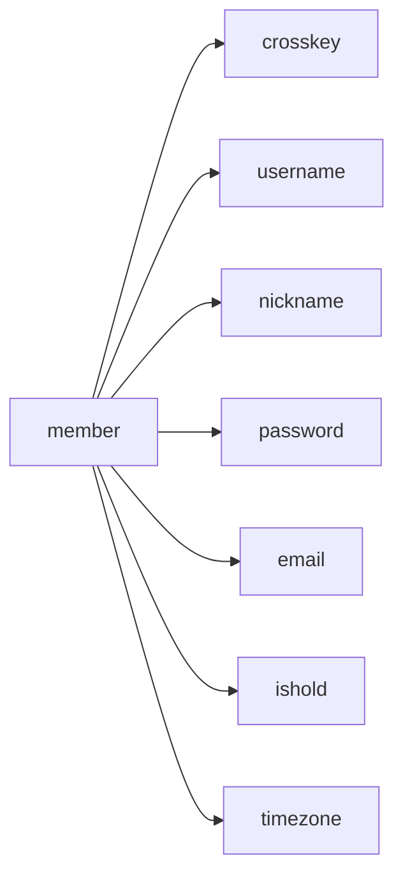
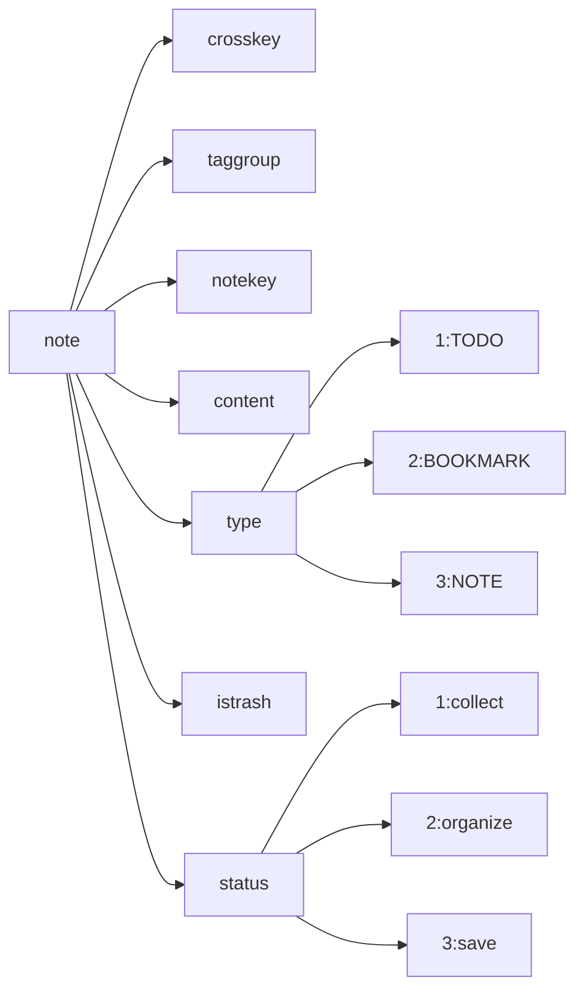
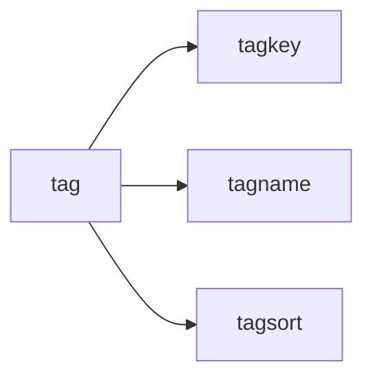

## Binge REST API

### Quickstart

### API reference

- **auth.js**

    #### Register

    | Title | Version | Status | Uri | Method | Response data foramt |
    |---|---|---|---|---|---|
    | Register | v1.0 | Done | /register | POST | json |

    #### Request

    ##### Headers:

    | Parameter | Required | Comment |
    |---|---|---|
    | Content-Type | Yes | Content-Type: application/json |
    
    #### Body
    
    | Parameter | Required | Comment |
    |---|---|---|
    | username | Yes | alphanumeric |
    | password | Yes | alphanumeric characters |

    #### Response

    ##### data

    | Key | Type | Required | Comment |
    |---|---|---|---|
    | status | int | Yes | 201 |
    | message | string | Yes | Success, Failed |

### Source Code Structure

- controllers contains the controller code, which is responsible for handling the specific logic of the API.

- middleware contains middleware codes for functions such as authentication.

- models contains model codes, which are used to define the database table structure and operation methods.

- routes contains routing code, which is used to define the interface path and request method of the API.

- utils contains tools and methods related to database connection.

### MongoDB Basic Structure

