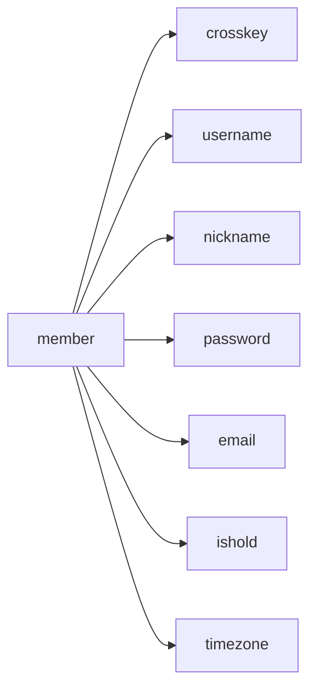
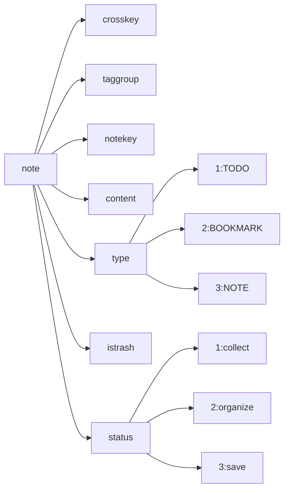
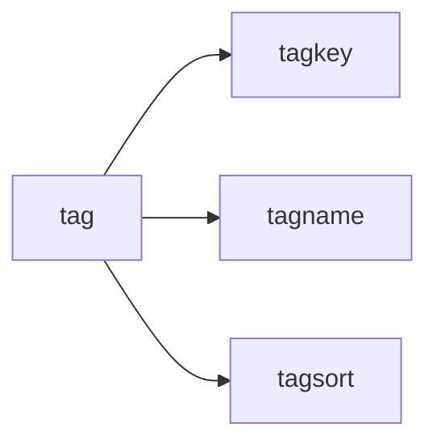

## API 部分

### 接口说明

第一个版本的 API 主要是下面这些内容

### 目录说明

API 目录下包括了所有的 API 相关代码。

- controllers 目录下包含控制器代码，负责处理 API 的具体逻辑；

- middleware 目录下包含中间件代码，用于实现认证等功能；

- models 目录下包含模型代码，用于定义数据库表结构和操作方法；

- routes 目录下包含路由代码，用于定义 API 的接口路径和请求方法；

- utils 目录下包含数据库连接相关的工具方法。

### MongoDB

